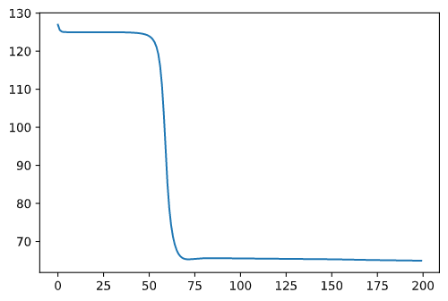

# NeuralNetFromScratch
This Repo contains implemetation of Neural Net from scratch using libraries padas and numpy 
## Architecture
3 layers
layer 1 -> 3 nodes
layer 2 -> 3 nodes
layer 3 -> 1 node
## Current results 

